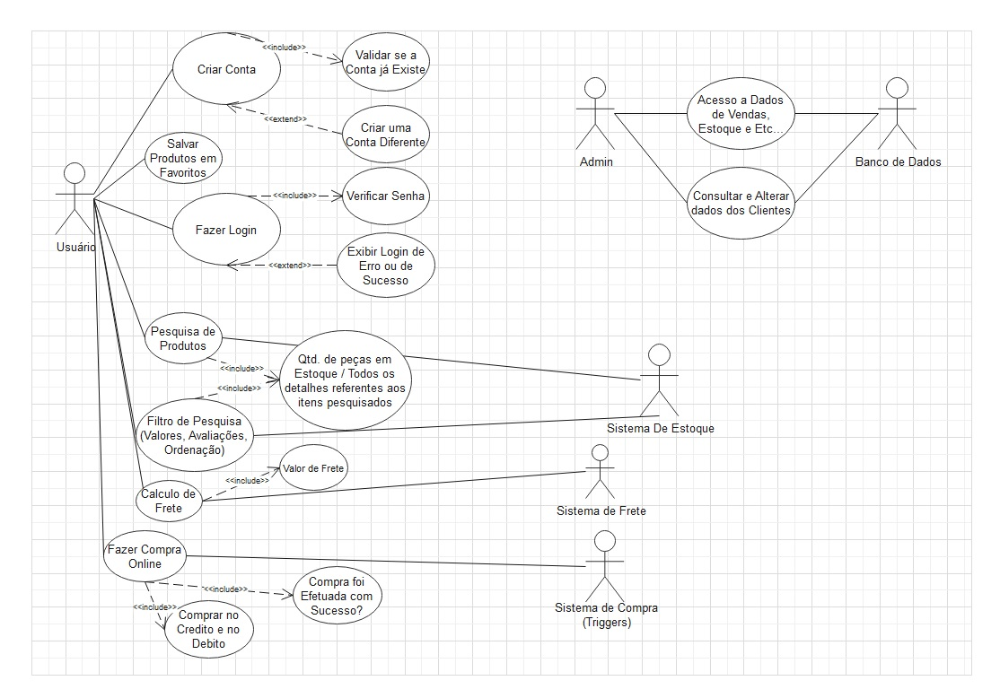

# Especificações do Projeto

Pré-requisitos: <a href="1-Documentação de Contexto.md"> Documentação de Contexto</a>

Neste projeto, com o escopo de criar uma aplicação interativa de vendas online, foi preciso reconhecer dois perfis principais, mulheres interessadas na compra para si mesmas ou para outras e homens motivados a comprar para terceiras. Foi assim, levantando os personagens da relação como persona do projeto, história do usuário, requisitos funcionais e requisitos não funcionais.  Os detalhes são especificados pelas personas e histórias de usuários em seguida. 

## Personas

As personas levantadas durante o processo de entendimento do problema são: 

Talita Machado, 35 anos, advogada sênior, atua em uma multinacional de telecomunicação e possui especialização na área de compliance.

Aplicativos 

•	Instagram 

•	Spotify 

•	WhastApp 

•	Twitter 

•	Disney Plus 

Motivações 

•   Passar o tempo junto ao filho	 

•  Seu trabalho e estudos 

•	Aprender algo novo   

Frustrações 

•	Não conseguir dedicar mais tempo ao seu filho 

•	Perder muito tempo em redes sociais 

•	A crise econômica e os constantes aumentos nos valores de alimentos, produtos e roupas  

•	Falta de perspectiva de melhora econômica 

Hobbies, História  

•	Gosta de ir ao cinema com seu filho 

•	Gosta de passear com seu cachorro aos finais de semana 

•	Gosta de ler 

•	Com a pandemia passou a fazer mais compras online, evitando sair de casa. 

•	Começou a fazer terapia, já que com a quarentena ficou mais estressada.  

Letícia Rocha, 25 anos,estudante de engenharia civil, atualmente é estagiária em uma grande empresa de gerenciamento de obras.   

Aplicativos 

•	WhatsApp 

•	Instagram 

•	TikTok 

•   Spotify 

•	Netflix 

•  Tinder 

Motivações 

•	Conseguir ser efetivada no seu estágio 

•	Ter filhos no futuro   

Frustrações 

•	Não ter conseguido ingressar antes da universidade 

•	A desvalorização profissional na sua área 

• O aumento do desemprego no país  

Hobbies, História 

•	Gosta de viajar 

•	Frequenta exposições de artes e museus 

•	Com a pandemia passou a confeccionar máscaras para doação 

•  Durante a pandemia trabalhou parte remotamente e em alguns momentos fazendo visitas às obras 

•  Atualmente mora com seus pais e planeja morar com duas amigas em breve 

Domique Xavier , 30 anos,recepcionista em um hospital de cardiologia, no momento é estudante em técnica de enfermagem 

Aplicativos 

•	WhatsApp 

•  Instagram 

•  Netflix 

• Amazon Video 

• GloboPlay   

Motivações 

•	Atuar como técnica de enfermagem 

•	Conseguir ajudar mais financeiramente sua família  

•	Se vacinar, para que a vida volte ao normal 

Frustrações 

•	Sofrer discriminação, ataques e intolerância por ser uma mulher transgênero 

•  Não conseguir fazer faculdade de enfermagem 

•  Dificuldade em comprar roupas e peças íntimas sendo trans 

•	Morar longe de sua família 

•	A crescente onda de desemprego    

Hobbies, História 

•   Gosta de escrever e planeja produzir um romance quando possível	 

•   Gosta de ir ao cinema e jantar com seus amigos 

•	Mulher transgênero que se mudou da sua pequena cidade natal por sofrer perseguições  

•	Com a pandemia ficou mais reclusa com sua gata e assiste mais séries e filmes na televisão 

•	Sonha um dia conseguir se formar como enfermeira 

Marcos Barbosa,33 anos, chefe de cozinha, trabalha em seu recém-inaugurado bistrô de cozinha contemporânea 

Aplicativos 

•	Instagram  

•	Facebook 

•	WhatsApp 

•   Pintrest 

•  Spotify 

Motivações 

•	Manter seu restaurante aberto 

•	Constituir uma família 

•	A retomada da ‘normalidade’ para que possa fazer um importante curso de confeitaria fora do país 

•  Poder proporcionar emprego para seus quatro funcionários  

Frustrações 

•	Ter baixo capital de giro para seu bistrô 

•	A crise econômica que afetou diretamente seu negócio 

•	A recusa de muitas pessoas à vacina, o que resulta no prolongamento de restrições ao seu estabelecimento  

•	Falta de tempo para dedicar a sua noiva, família e amigos 

Hobbies, História 

•	Gosta de cozinhar para sua família e amigos 

•	Pinta quadros  

•	Gosta de ir à praia  

•	Seu sonho é abrir em breve uma confeitaria 

•    Costuma fazer compras online e gosta de presentear sua noiva 

 Carla Almeida, 22 anos, operadora de caixa em uma rede de hipermercados  

Aplicativos 

•	Instagram  

•	WhatsApp 

•  Spotify 

•  Pintrest  

Motivações 

•	Conseguir cursar universidade 

•	Seu maior desejo é aumentar sua renda 

•	 Sonha em morar sozinha 

•  Conhecer o mundo  

Frustrações 

•	Não ter renda suficiente para se sustentar 

•	A crise econômica que resultou na sua demissão 

•	Dificuldade em vender seus bolos e doces  

•	Tentou revender bijuterias pela rede social porém não teve tempo para gerenciar o negócio  

Hobbies, História 

•	Gosta de fazer bolos e doces 

•	Anda de skate ocasionalmente  

•	Gosta de ir à jogos de futebol  

•	Gostaria de ter uma renda extra 

•    Costuma fazer compras online e olhar as novidades de roupas, sapatos e acessório nas redes sociais 
 

## Histórias de Usuários

Com base na análise das personas forma identificadas as seguintes histórias de usuários:

|EU COMO... `PERSONA`| QUERO/PRECISO ... `FUNCIONALIDADE` |PARA ... `MOTIVO/VALOR`                 |
|--------------------|------------------------------------|----------------------------------------|
|Talita Machado    | comprar de forma assertiva presentes | facilidade de troca e de acertar nos tamanhos|
|Talita Machado    | comprar roupas para os novos cursos e aulas que planejo fazer | comprar com comodidade e qualidade|
|Leticia Rocha     | comprar novo vestuário tendo em vista meu plano de carreira| compra tendo um diálogo simples entre loja e usuário |
|Dominique Xavier  | comprar roupas sem temer o julgamento e preconceito | como mulher trans um grande obstáculo e se sentir à vontade e confortável na hora da compra |
|Marcos Barbosa    | fazer compras de forma direta e simples visando o pouco tempo entre as minhas funções | com as novas responsabilidades e problemas o quão mais simples e direto economiza tempo|
|Marcos Barbosa    | compra vestuário simples para meus funcionários | criar um passatempo com minha noiva visando o pouco tempo que tenho dedicado a ela|
|Carla Almeida    | complementar meu vestuário com roupas na minha numeração | comprar roupas online e bem difícil por não ter as medidas e tamanhos| 

## Requisitos

O escopo funcional do projeto é definido por meio dos requisitos funcionais que descrevem as possibilidades de interação dos usuários, bem como os requisitos não funcionais que descrevem os aspectos que o sistema deverá apresentar de maneira geral. Estes requisitos são apresentados a seguir.  

### Requisitos Funcionais

|ID    | Descrição do Requisito  | Prioridade |
|------|-----------------------------------------|----|
|RF-001| O site deve apresentar na página principal sobre a empresa e os produtos que são vendidos.| ALTA | 
|RF-002| O site deve permitir a compra de forma on-line.  | ALTA |
|RF-003| O site deve calcular frete de acordo com a região de onde a pessoa irá comprar. | MÉDIA |
|RF-004| O site deve permitir que o cliente efetue os pagamentos de compra através de crédito ou débito. | MÉDIA |
|RF-005| O site deve criar login dos usuários. | ALTA |
|RF-006| O site deve permitir que os clientes saibam as medidas de cada peça. | BAIXA |
|RF-007| O site deve oferecer uma funcionalidade de filtro/pesquisa para permitir ao usuário localizar um produto específico que será informado na caixa de pesquisa.  | MÉDIA |
|RF-008| O site deve permitir salvar as fotos das postagens. | BAIXA |
|RF-009| Geração de relatório de vendas realizadas.  | MÉDIA |
|RF-010| Permitir que o cliente verifique quantas peças há no estoque. | BAIXA |
|RF-011| Consulta e alterar dados pessoais de clientes.  | ALTA |

### Requisitos não Funcionais

|ID     | Descrição do Requisito  |Prioridade |
|-------|-------------------------|----|
|RNF-001| O sistema deve ser Web.  | ALTA| 
|RNF-002| O desenvolvimento deve ser em linguagem C#. |  ALTA | 
|RNF-003| Emissão de relatório deve ser assíncrono.  |  BAIXA | 
|RNF-004| Integração com gateway de pagamento via REST Full. |  MÉDIA | 
|RNF-005| O banco de dados deve ser relacional, utilizando MySQL.  |  ALTA | 
|RNF-006| O frete irá usar uma API para ser calculado. |  BAIXA | 

 
## Restrições

As questões que limitam a execução desse projeto e que se configuram como obrigações claras para o desenvolvimento do projeto em questão são apresentadas na tabela a seguir.   

|ID| Restrição                                             |
|--|-------------------------------------------------------|
|01| Entrega do projeto até o mês de julho/2021|
|02| Falta de conhecimento técnico.|
|03| Mudanças significativas no escopo do projeto.|

## Diagrama de Casos de Uso

O diagrama de casos de uso é o próximo passo após a elicitação de requisitos, que utiliza um modelo gráfico e uma tabela com as descrições sucintas dos casos de uso e dos atores. Ele contempla a fronteira do sistema e o detalhamento dos requisitos funcionais com a indicação dos atores, casos de uso e seus relacionamentos. 

